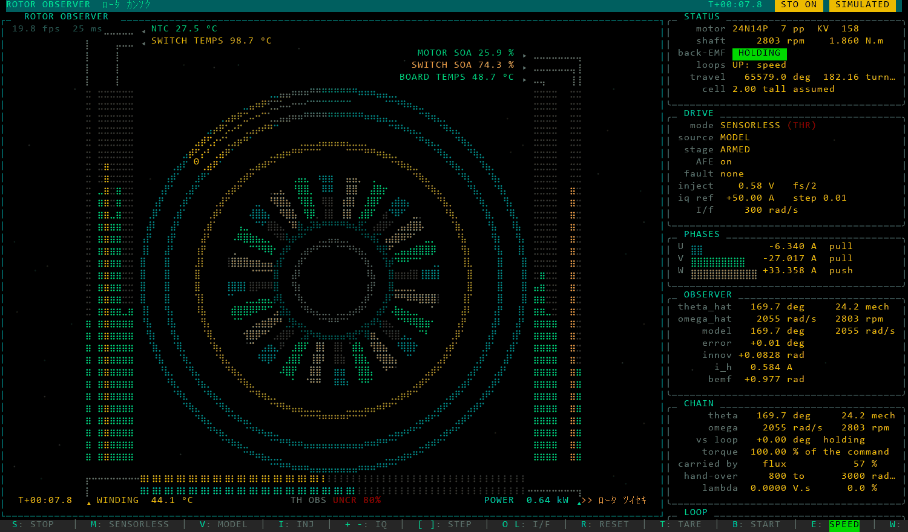
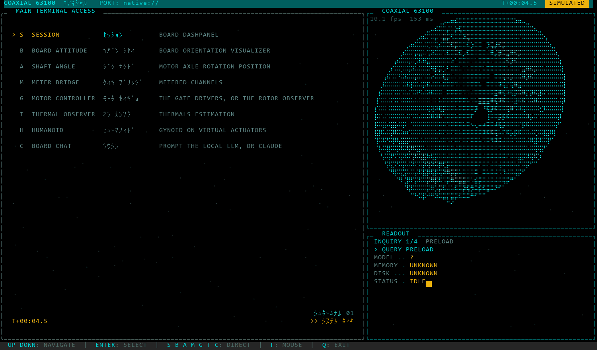
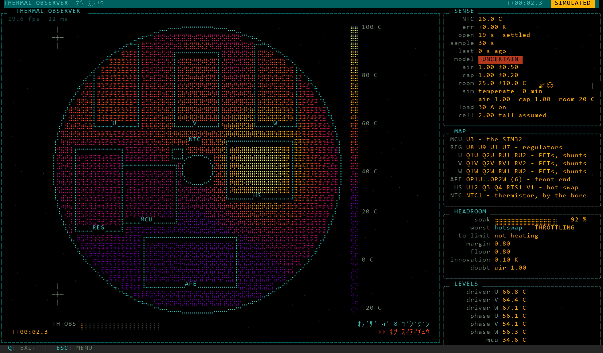
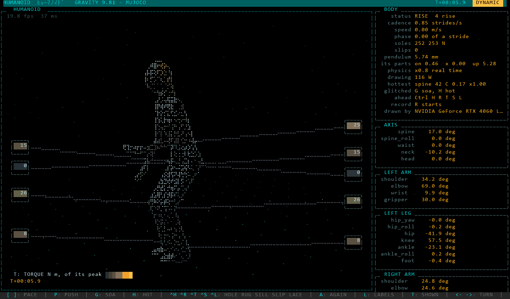

# Coaxial 63100

A three-phase BLDC inverter whose PCB sits coaxially behind an outrunner's
stator - 63 V, 100 A, an STM32H753VIT6 at 475 MHz - its firmware (the
application and a bootloader), the Python host that drives a board or
sequences boards into machines, and the emulation that runs the firmware with
no board. *Coaxial* is the placement: no coax cable or connector exists.

<p align="center">
  
</p>

*Figure 1. The rotor observer on the stand-in: the demo up at 2 803 rpm on
the 50 A clamp, 0.64 kW into the motor, the estimate 0.01 deg off the
model's rotor.*

## 1 Setup

```powershell
powershell -ExecutionPolicy Bypass -File .\setup.ps1   # pull, check, install, build, emulate
. .\env.ps1                                           # each shell: PATH + aliases
.\coaxial_tty.ps1                                     # terminal front page
```

<details><summary>What setup does, the views and their keys</summary>

`setup.ps1` checks every dependency before it fetches any, asks once for the
plan (`-Yes`: not at all), builds both images and runs the Debug one on
Renode; `-Check` only reports. Its stages and areas are `setup/*.ps1`.

Views (`host/terminal/pages/`, one module each): session, imu (attitude),
angle, adc (meter bridge), gate_drivers (the one that switches), rotor
observer, thermal observer, humanoid (a gynoid walking under gravity,
MuJoCo, a drive a joint), chat. `.\coaxial_tty.ps1 adc -Simulated` opens one
with no cable; `-Frames N` ends it after N frames. In a view: Q quits, ESC
returns to the front page. The 3D pages raster on the GPU where a card
answers (wgpu); `COAXIAL_GPU=0` keeps them on the CPU.

</details>

## 2 The board

Three phase shunts, the DC link and an NTC through the analogue front end,
sampled on TIM1 at 50 kHz; the gate drivers supplied by the STO chain. Its
schematic and layout: [Coaxial-63100 on CircuitMaker](https://workspace.circuitmaker.com/Projects/Details/RogerIsakssonLehtipalo/Coaxial-63100).

<details><summary>The front end, the gate stage, the parts, the link</summary>

- **Measurement.** The shunts, the DC link and the NTC into ADC1-3 on TIM1:
  centre-aligned, the dead time from the calibration record, the break on
  PE15. Scaling lives once, in the calibration record.
- **The gate stage.** The drivers' supply comes from the STO chain, not the
  MCU: the master's pilot on the RS485 pair, the MCU's keepalive, FAULTOUT on
  the break ([HARDWARE](docs/HARDWARE.md)). Only gate op 1 sets MOE.
- **Parts.** An A1335 angle sensor on the shaft and a BNO085 IMU. What is
  fitted comes from the board (`0x6D` kind 4), never from a name.
- **The link.** One UART, the console or Modbus RTU: the ST-Link's virtual COM
  port, or RS485 on a limb of boards ([PROTOCOL](docs/PROTOCOL.md)).

</details>

## 3 The firmware

C11 in layers, `core/` (CubeMX) -> `board/` -> `comms/` -> the portable
cores, each core tested on this host through gcc.

<details><summary>The layers, the drive, the heat, the bootloader</summary>

- `core/`: CubeMX, generated; edited only inside its `USER CODE` blocks.
- `board/`: the hardware, one API header a `board_<x>.c`
  (`comms/inc/board/<x>.h`).
- `comms/`: the Modbus map and the 0x6E device operations - command tables,
  a handler `h_<device>_<op>` each, requests read and replies written.
- The cores: `modbus drive thermal filter daq shtp boot ctrl`, portable C11.
- The drive runs field-oriented current control each PWM period, its rotor
  angle from high-frequency injection at rest and the back-EMF above the
  crossover: 2 922 of a period's 9 500 cycles, its sample path from ITCM.
- The thermal core carries the board's heat network, its envelope - which
  drops MOE at the record's ceiling - and the observer.
- The bootloader loads the host's own build over the bus at 10 Mbit:
  `Coaxial63100.open()` loads it into a board running another or waiting
  blank ([BOOT](docs/BOOT.md)).

</details>

## 4 Data-oriented design

One shape on both sides: data in, a step, data out; memory laid once; the
order a table; the hardware at one edge ([ARCHITECTURE](docs/ARCHITECTURE.md)).

<details><summary>The shape, in the code</summary>

Target: static structs, a step touching its arguments only, tables of
function pointers walked in order; the board layer fills the buffers the
cores read.

```c
/* drive/inc/drive.h: one PWM period */
bool drive_step(drive_t *d, const drive_sample_t *in, bool stage_enabled,
                drive_out_t *out);

/* ctrl/src/ctrl.c: a part's regulator, by kind */
static const ctrl_regulate_fn REGULATORS[CTRL_KINDS] = {
  [CTRL_PI] = pi, [CTRL_ANGLE_HOLD] = angle_hold, [CTRL_DIRECT] = direct,
  [CTRL_SPEED_PI] = speed_pi
};
```

Host: numpy structured arrays, a field a channel and a row a board, stepped
every row at once; one edge polls and pushes over the transport, a lost
frame counted and never raised into a step
(`notebook_examples/cycle.ipynb`):

```python
f = cyclic.frame('w_target', 'omega_hat', 'w_ref', 'iq_ref', rows=len(legs))
edge = cyclic.edge(legs, 'drive', ins=('omega_hat',), outs=('iq_ref',))
TABLE = (
    (cyclic.slew, cyclic.state('Slew', n, rate=100.0), ('dt', 'w_target'), 'w_ref'),
    (cyclic.pi, cyclic.state('PI', n, kp=0.1, ki=0.3, limit=3.0),
     ('dt', 'w_ref', 'omega_hat'), 'iq_ref'),
)
log = cyclic.run((edge,), TABLE, f, CYCLES, PERIOD)
```

</details>

## 5 Where it runs

| Mode | What runs | For |
| --- | --- | --- |
| `HARDWARE` | a board on a COM port | the bench |
| `SIMULATED` | the stand-in: software models claiming no hardware | pages and machines, no cable |
| `EMULATED`, `emulator://` | the firmware's own image on Renode's STM32H753 | validating the firmware |
| `EMULATED`, `native://` | the board layer and the cores built for this host | SIL and HIL, in real time |

<details><summary>What each models, how fast, the fallback</summary>

- `emulator://`: the front end from the schematic and LTspice, the A1335, the
  BNO085 and the STO chain on the master's pilot modelled; conformance
  110/110; a limb of N boards on one RS485 bus; each UART at the rate its RCC
  and BRR give it. Renode runs 3.8-4.5 wall s a board s under the drive.
- `native://`: TIM1, the ADCs, SPI and DMA, the front end and the parts
  modelled around the board layer: 18x headroom a board with the drive on;
  `?body=humanoid` its 20 boards on 5 buses, a thread a limb, 2.2 cores. The
  terminal's pages default to it.
- Where no board answers: the emulator, and the stand-in where no emulator
  runs (no Renode, no image, `COAXIAL_FALLBACK=simulated`).
- No firmware source asks where it runs; the target builds nothing of
  `board/fake`, `board/native`, `board/emu`.

</details>

## 6 Examples

Every board found on a machine's buses, and what it is told to do:

```python
from machine import SIMULATED, Machine
humanoid = Machine.discover('humanoid', execution_mode=SIMULATED)
print(humanoid.prompt())                                # what a model is told
humanoid.run('0 run=squat times=2\n0 run=walk stride=15')
```

<details><summary>A recording, the board's own clock on each sample</summary>

```python
from coaxial import Coaxial63100
with Coaxial63100(port='COM4') as device:      # execution_mode=SIMULATED: no cable
    daq = device.daq
    daq.open(); daq.enable(); device.set_time_from_pc()
    daq.configure('phaseU', 'NTC')                  # names in any spelling
    daq.start()                                     # reader thread drains the board
    for r in daq.read(-1):
        print(r.start_time, r.dt, [(s.name, s.value) for s in r.samples])
```

</details>

<details><summary>A sensorless start on native://, armed through the pilot</summary>

The stage armed as the schematic arms it - the master's pilot, the
interlock, no bypass - and the drive's gains from commissioning's arithmetic
on the record:

```python
import time
from coaxial import EMULATED, Coaxial63100
from coaxial.control.commission import Commissioning
from coaxial.simulated.sto import PILOT_VOLTS

with Coaxial63100(port='native://', execution_mode=EMULATED) as rig:
    rig.board.afe.on()
    rig.pilot(PILOT_VOLTS)                          # the STO chain supplies the drivers
    while not all(row[2] for row in rig.gates.interlock()):
        time.sleep(0.1)
    rig.gates.on()
    print(Commissioning(rig).gains()['written'])    # PI, injection, Kalman, crossover
    rig.drive.write(id_ref=0.0, iq_ref=5.0)
    rig.drive.on('sensorless')
    time.sleep(1.0)
    pairs = rig.drive.params()['motor_pole_pairs']
    print('%.0f rpm' % (rig.drive.state()['omega_hat'] / pairs * 9.549))
    rig.drive.off()
```

</details>

<details><summary>The board's heat, and what the envelope leaves</summary>

```python
from coaxial import EMULATED, Coaxial63100
with Coaxial63100(port='native://', execution_mode=EMULATED) as rig:
    print(rig.board.thermal.state())
    print(rig.board.thermal.budget())
```

</details>

<details><summary>The library's rules</summary>

- `r['NTC']` is the board's sum, `r.value('NTC')` the mean, `r.samples` the
  per-channel structs; `daq.catalogue()` lists what can be recorded.
- `device.motion`: `stepper`, `servo`, `velocity` (arm the stage first).
- Everything raises rather than returning a status. Channels and parts come
  from the board.
- `host/machine/` imports no board: a family (`coaxial.node`) is loaded by
  `Nodes.discover` when installed. Types: humanoid, gynoid, quad, fixed_wing,
  ebike.

</details>

## 7 The pages

Eight on the front page, drawn in braille on the terminal: the session, the
board's attitude, the shaft's angle, the meter bridge, the motor controller,
the thermal observer, the humanoid and the board chat.

<details><summary>Figures 2-4: the front page, the heat, the gynoid</summary>



*Figure 2. The front page on `native://`, the board turning in its corner.*



*Figure 3. The thermal observer: the board's heat network under 30 A a
phase, the drivers at 64-67 C, the hot swap the worst of its headroom.*



*Figure 4. The humanoid: a gynoid rising under gravity in MuJoCo, a drive a
joint, each joint's torque against its peak.*

Each drawn on the stand-in by `python host/tools/render/page.py <page>
--size 150 44 --frames <n> --png <file>`.

</details>

## 8 Notebooks

Fourteen executed papers in `notebook_examples/`, generated from
`host/tools/notebooks/`.

<details><summary>The fourteen, and how they are made</summary>

Acquisition, link, sensors, power_stage, thermal, drive, controller, cycle,
sequencer, machines, director, motion, applications, commissioning: each a
setup, numbered sections, results and references.

```powershell
python host/tools/notebooks/make_notebooks.py --execute [area ...]
```

</details>

## 9 Build and test

```powershell
cube-cmake --build --preset Debug              # zero warnings; two images (app + bootloader)
python host/tools/target/build_and_flash.py    # --boot flashes the bootloader first
.\host\run_tests.ps1                           # ~25 %; -All the gate; -Structure 4 s
python host/tools/dev/cover.py --readme        # the gate under coverage, into section 10
```

<details><summary>CI</summary>

Both presets built, the image run on Renode and the offline suites on every
push; a red run leaves its log's tail as a comment on its commit.

</details>

## 10 Results

<!-- coverage -->
Generated 2026-09-28 at `647aea1` by `python host/tools/dev/cover.py --readme`:
one offline run (`host/tools/dev/run_tests.py --offline`), the Python under
coverage.py, the C under gcov. ST's generated code - CubeMX's core/, startup and
cmake/stm32cubemx/, the HAL - is not counted.

| Code | Lines | Covered |
| --- | ---: | ---: |
| **Host**: host/'s Python, the emulation's C | 36162 | **76.5 %** |
| **Target**: the firmware's C, the target-only files uncovered | 9618 | **72.5 %** |

3866 checks in 32 suites: 3866 passed, 0 failed; 323 skipped, a board's.

<details><summary>Each suite, each part</summary>

| Suite | What it holds | Checks | Failed | s |
| --- | --- | ---: | ---: | ---: |
| test_structure.py | Does `host/` still hold together? | 1311 | 0 | 19 |
| test_modbus_core.py | The portable Modbus core, on this host, with no board and no cable. | 78 | 0 | 1 |
| test_shtp_core.py | SHTP framing and SH-2 decoding, on this host, with no IMU. | 38 | 0 | 1 |
| test_drive_core.py | The control law, on this host, against a motor that exists only here. | 90 | 0 | 6 |
| test_filter_core.py | The anti-alias chain, run for real and judged against the arithmetic. | 42 | 0 | 1 |
| test_thermal_core.py | The thermal envelope, run as the C that will run on the board. | 146 | 0 | 10 |
| test_daq_core.py | The acquisition engine, run as the C that will run on the board. | 59 | 0 | 1 |
| test_boot_core.py | The bootloader's state host as the C that will run, on byte-array flash and RAM. | 71 | 0 | 1 |
| test_ctrl_core.py | The board's parts and feedback (ctrl/), stepped beside host/machine/parts.py. | 21 | 0 | 1 |
| test_world_core.py | The world core (world/): the loads a machine's motors turn and its body, against closed forms; a board's heat and its STO chain against their circuits. | 15 | 0 | 3 |
| test_wire.py | The device clients through the firmware's own wire, on this host. | 9 | 0 | 13 |
| test_sensorless.py | The sensorless design arithmetic, and the commissioning against the stand-in. | 138 | 0 | 137 |
| test_broker.py | coaxial.comm.broker: one process owns the port, everything else asks it. | 33 | 0 | 28 |
| test_daq_api.py | The acquisition front door: picking channels, reading them, shaping them. | 82 | 0 | 81 |
| test_controller.py | The controller: feedback loops over float channels, its parts, its panel, its sequencer. | 130 | 0 | 132 |
| test_cyclic.py | The cyclic executive (machine.cyclic): its steps against machine.parts, its cycle on a toy rotor. | 13 | 0 | 1 |
| test_boot.py | The master's side of the bootloader against the stand-in (docs/BOOT.md). | 24 | 0 | 0 |
| test_views.py | Every live view runs two frames against the stand-in, as a subprocess. | 274 | 0 | 118 |
| test_render.py | The 3D engine, stage by stage, against exact expectations. | 146 | 0 | 20 |
| test_ollama_tools.py | The tool surface: schemas, arguments, which tool answers what. | 219 | 0 | 10 |
| test_ollama_runner.py | The plan runner, the sandbox, and the test tooling itself. | 224 | 0 | 13 |
| test_ollama_prompt.py | SYSTEM, the per-turn hints, and what the model is told. | 113 | 0 | 2 |
| test_ollama_link.py | The serial link: ports, probing, diagnosis, recovery. | 114 | 0 | 9 |
| test_ollama_render.py | How a result reaches the screen: columns, blocks, clipping. | 32 | 0 | 1 |
| test_ollama_bus.py | Nodes, segments, unit ids, broadcast. | 28 | 0 | 1 |
| test_ollama_board.py | The board, its channels, its pins, the AFE. | 28 | 0 | 2 |
| test_ollama_reply.py | What an answer means: retypes, blank answers, nudges. | 23 | 0 | 1 |
| test_ollama_language.py | The session language, its lock, and the phrase table. | 12 | 0 | 1 |
| test_simulated.py | coaxial.simulated: a board that was never plugged in. | 257 | 0 | 94 |
| test_native.py | The board layer's drive path on this host, in real time: `native://`. | 16 | 0 | 18 |
| test_emulator.py | The firmware's own image on an emulated MCU, its front end fed from the electronics. | 21 | 0 | 177 |
| test_mcp.py | End-to-end test of the MCP server, plus a token accounting. | 59 | 0 | 29 |

| Host | Lines | Covered | Run by |
| --- | ---: | ---: | --- |
| board/fake | 546 | 70.7 % | the emulation |
| board/native | 849 | 90.2 % | the emulation |
| world | 604 | 95.4 % | the emulation |
| coaxial | 14330 | 88.8 % | the suites |
| coaxial_mcp | 817 | 89.6 % | the suites |
| coaxial_ollama | 2809 | 81.1 % | the suites |
| machine | 3991 | 90.9 % | the suites |
| motor | 132 | 93.9 % | the suites |
| terminal | 5354 | 78.4 % | the suites |
| testline | 143 | 44.8 % | the suites |
| tools/bench | 972 | 3.8 % | a board |
| tools/cores | 687 | 95.9 % | the core suites |
| tools/dev | 1595 | 31.3 % | the gate and by hand |
| tools/emu | 646 | 68.0 % | the emulator suite |
| tools/notebooks | 336 | 39.9 % | the papers, as notebooks |
| tools/render | 758 | 16.1 % | by hand |
| tools/sim | 786 | 20.7 % | by hand |
| tools/target | 383 | 30.8 % | a board |
| tools/thermal | 424 | 0.0 % | a board |

| Target | Lines | Covered |
| --- | ---: | ---: |
| board/src | 3136 | 60.3 % |
| boot | 725 | 58.9 % |
| comms | 2465 | 64.7 % |
| ctrl | 188 | 92.0 % |
| daq | 506 | 97.4 % |
| drive | 870 | 96.8 % |
| filter | 105 | 80.0 % |
| modbus | 468 | 93.4 % |
| shtp | 102 | 95.1 % |
| thermal | 1053 | 88.8 % |

Built for the target only, none of their lines run here (the bench's conformance
suite is theirs): `board/src/board_boot.c`, `board/src/board_clock.c`,
`board/src/board_flash.c`, `board/src/board_selftest.c`, `boot/src/boot_main.c`,
`comms/src/console.c`, `comms/src/dev_uart.c`, `comms/src/link_report.c`,
`comms/src/testrig.c`.

</details>
<!-- /coverage -->

**Bench.** The bench board is unmodified (R93 on +5): AFE_ON high unpowers
its drivers, and no current is measured while switching there. Measured:
duty 1-100 % dry; three legs switching dry at 24-60.8 V, 25 and 50 kHz, the
thermal observer within 0.2 K of the thermistor after 120 s blind at 53.8 V;
26 pulse runs into 8 ohm at 25 and 31 V, 3.1-3.75 A.

## References

- [docs/ARCHITECTURE.md](docs/ARCHITECTURE.md) - the layout, the
  data-oriented design, the tests
- [docs/PROTOCOL.md](docs/PROTOCOL.md) - everything on the wire
- [docs/HARDWARE.md](docs/HARDWARE.md) - the board, before a measurement
- [docs/BOOT.md](docs/BOOT.md) - the bootloader and the flash map
- [docs/MODELS.md](docs/MODELS.md) - the local model
- [docs/FINDINGS.md](docs/FINDINGS.md) - what was measured and settled on the
  board, and by subject in [docs/findings/](docs/findings/): read it before
  investigating anything
- [docs/TODO.md](docs/TODO.md) - open work
